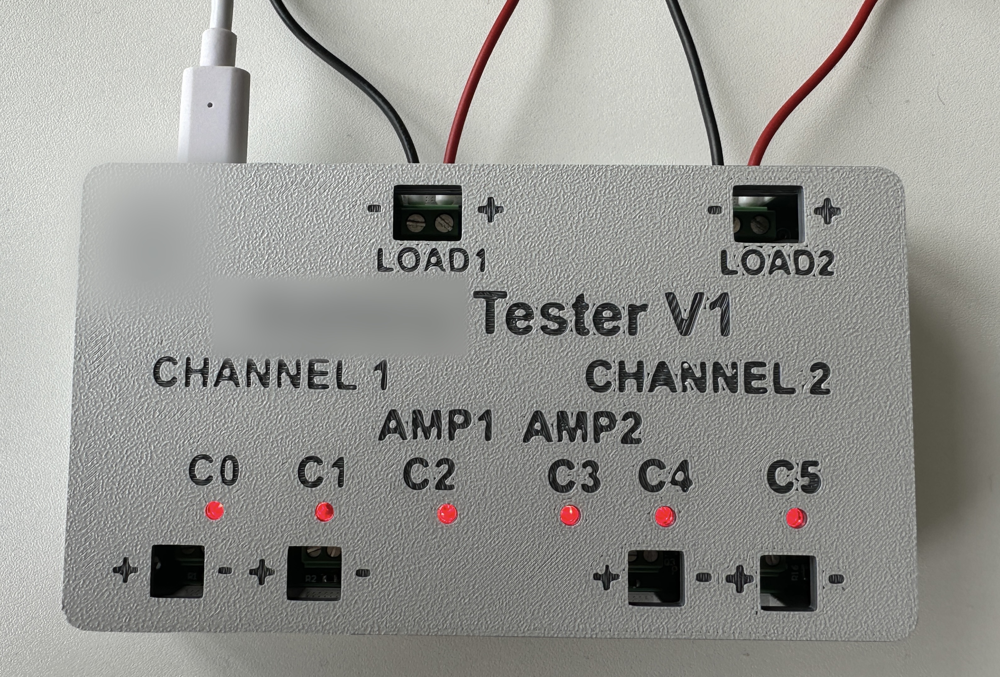
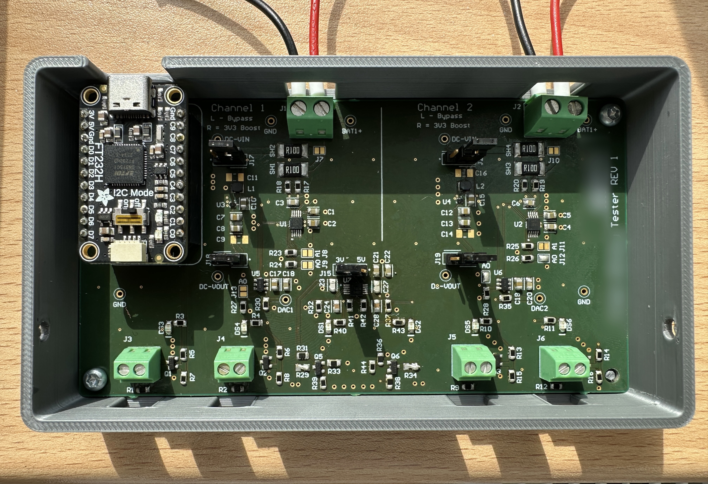

<h1 align="center">⚡ Automated Power Test Platform</h1>

<p align="center">
  Custom hardware/software test platform combining programmable loads,
  multi-point power monitoring, Python automation, data analysis,
  and purpose-built mechanical design.
</p>

<p align="center">
  
  
  
  
  
  
</p>

<p align="center">
  
</p>

## 📌 Overview

Custom automated test fixture integrating **measurement, load control,
data acquisition, analysis, and mechanical design** into a single system.

A host-side **Python** application communicates with the PCB through an
**FT232H**, controlling test hardware and collecting measurements from
multiple INA power monitors.

The platform supports both **switched MOSFET loads** and **programmable
current loads**, allowing fixed, pulsed, timed, and dynamically controlled
test profiles.

> **My work:** system architecture · Altium schematic & PCB design · Python
> automation · FT232H interfacing · power measurement · programmable loads ·
> data analysis · 3D CAD & printing

---

## ⚡ Hardware

The custom PCB combines several test functions:

| Function               | Implementation                                         |
| ---------------------- | ------------------------------------------------------ |
| **Host Interface**     | FT232H USB → GPIO / I²C                                |
| **Input Monitoring**   | INA voltage & current measurement                      |
| **Output Monitoring**  | Independent INA voltage & current measurement          |
| **Switched Loads**     | Software-controlled MOSFET load paths                  |
| **Programmable Loads** | MCP4725 DAC + MOSFET current-load stages               |
| **Protection**         | Automatic voltage-based load shutdown                  |
| **User Feedback**      | Light guides show active outputs through the enclosure |

The two load approaches provide different capabilities: switched paths allow
simple and repeatable fixed-load testing, while the programmable MOSFET stages
allow software-controlled current profiles and dynamic loading.

---

## 🐍 Automation & Data Analysis

Custom Python tooling controls the fixture, coordinates multi-channel
measurements, executes timed load profiles, logs test data, and manages
automatic cutoff behaviour.

```text
Host PC
  │
  │ Python
  ▼
FT232H
  │
  ├── INA Input Measurement
  ├── INA Output Measurement
  ├── Switched MOSFET Loads
  └── Programmable Current Loads
```

A separate analysis pipeline processes the recorded datasets to calculate
**electrical performance metrics, test duration, voltage-cutoff behaviour,
channel quality, and comparison results**, then generates summary CSVs and
graphs.

---

## 💡 Mechanical Design

<p align="center">
  
</p>

The enclosure was designed in **Fusion 360** around the electronics.

Integrated **light guides** make active output channels immediately visible
from outside the enclosure, providing useful feedback during testing and
debugging without exposing the PCB.

---

## 📷 Physical Build

<table>
<tr>
  <td width="50%" align="center">
    
    <br>
    <sub><b>Complete Test Fixture</b></sub>
  </td>

  <td width="50%" align="center">
    
    <br>
    <sub><b>Internal Electronics</b></sub>
  </td>
</tr>
</table>

The final fixture combines the custom PCB, 3D-printed enclosure, output-state
light guides, and test interfaces into a single self-contained unit.

---

## 📁 Public Repository

```text
Automated-Power-Test-Platform/
├── Hardware/
│   ├── PCB/
│   └── Enclosure-3D-model/
├── docs/
│   └── images/
└── README.md
```

> [!NOTE]
> This repository contains a curated public subset of the project.
> Control software, raw test data, exact test procedures, and other
> implementation details are intentionally excluded.

---

<p align="center">
  <a href="../README.md">← Back to Engineering Portfolio</a>
</p>
