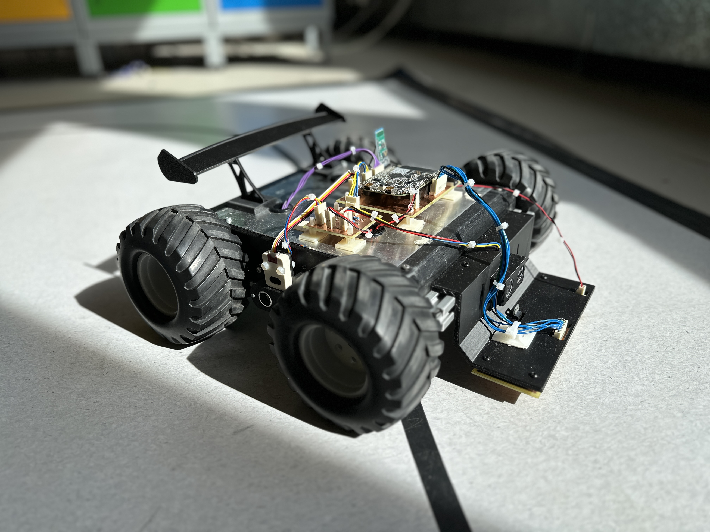

<h1 align="center">🤖 Autonomous Line-Following Rover</h1>

<p align="center">
  Autonomous embedded vehicle combining sensing, control software,
  motor electronics, and system integration.
</p>

<p align="center">
  
  
  
  
  
  
</p>

<p align="center">
  
</p>

## 📌 Overview

This rover was developed as a third-year engineering team project and was
designed to navigate a marked course autonomously while responding to line
position, obstacles, and colour cues.

The final system integrates **line sensing, ultrasonic ranging, colour
detection, motor control, Bluetooth communication, and debug telemetry**
around an NXP FRDM-KL25Z microcontroller.

> [!NOTE]
> **My contribution:** team lead · control architecture · embedded C++ ·
> motor electronics · sensor integration · system bring-up

---

## ✨ Capabilities

| Capability               | Implementation                                      |
| ------------------------ | --------------------------------------------------- |
| **Line Following**       | Multi-sensor line detection and corrective steering |
| **Line Recovery**        | Dedicated seek and alignment states                 |
| **Obstacle Avoidance**   | Front and side ultrasonic sensing                   |
| **Colour Detection**     | TCS3472 RGB colour sensor                           |
| **Manual Control**       | Bluetooth serial control                            |
| **Control Architecture** | Explicit state-based controller                     |
| **Telemetry**            | Runtime debug output                                |
| **Firmware**             | C++ using Mbed and PlatformIO                       |
| **Controller**           | NXP FRDM-KL25Z                                      |

---

## 🧠 Control Architecture

The rover software is organised around explicit operating states rather than
a single monolithic control loop.

```text
                         ┌─────────────┐
                         │   FOLLOW    │
                         └──────┬──────┘
                                │
              ┌─────────────────┼─────────────────┐
              ▼                 ▼                 ▼
        ┌───────────┐     ┌───────────┐    ┌───────────────┐
        │ SEEK LEFT │     │SEEK RIGHT │    │OBSTACLE AVOID │
        └─────┬─────┘     └─────┬─────┘    └───────┬───────┘
              └──────────┬──────┘                  │
                         ▼                         │
                     ┌───────┐                     │
                     │ ALIGN │◄────────────────────┘
                     └───┬───┘
                         │
                         ▼
                     ┌────────┐
                     │ FOLLOW │
                     └────────┘
```

This separation makes autonomous behaviour easier to reason about and
debug, particularly during line recovery and obstacle-avoidance manoeuvres.

Additional controller states handle braking, stopping and Bluetooth manual
control.

---

## 💻 Embedded Software

The firmware is written in **C++** using **Mbed** and built through
**PlatformIO**.

The software separates the main controller from hardware-specific modules
for motors, sensors, ultrasonic ranging, colour detection and debugging.

Periodic tasks handle control updates, ultrasonic measurements, colour
sensing and debug output without placing all functionality into one
blocking loop.

Key source files are available in [`Software/src/`](Software/src/) with
hardware abstractions and configuration in
[`Software/include/`](Software/include/).

---

## 📁 Project Structure

```text
Autonomous-Line-Following-Rover/
├── Software/
│   ├── include/
│   ├── src/
│   └── platformio.ini
├── docs/
│   ├── images/
│   └── Guide_For_University_Showcases/
└── README.md
```

The showcase directory also contains pre-built firmware images for
demonstration use, including full-functionality and line-following-only
builds.

---

<p align="center">
  <a href="../README.md">← Back to Engineering Portfolio</a>
</p>


