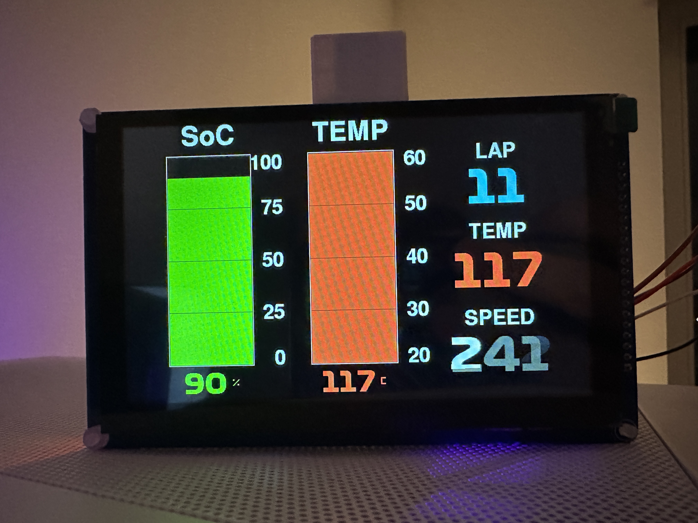
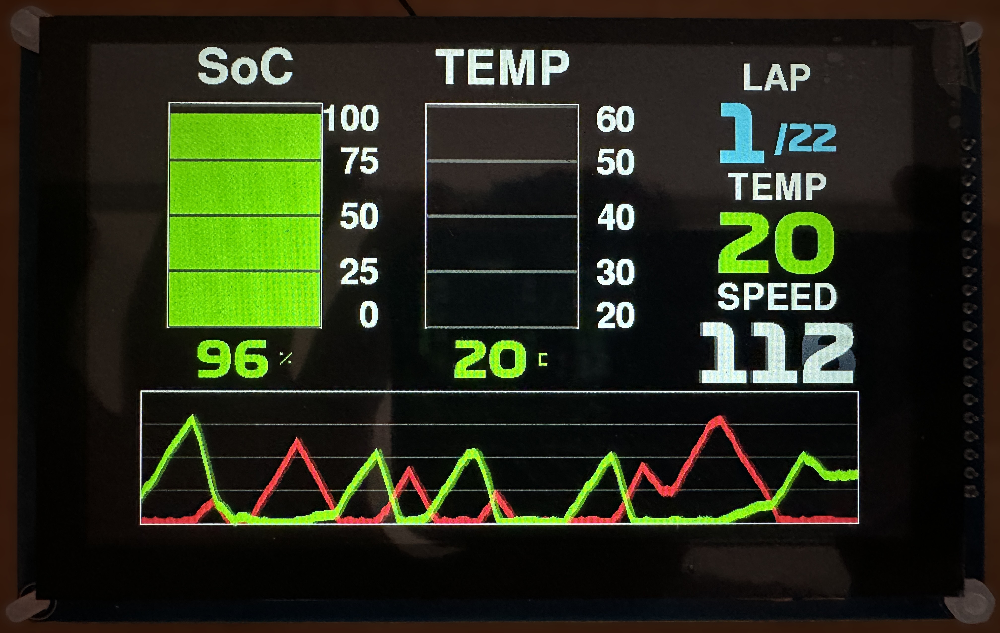
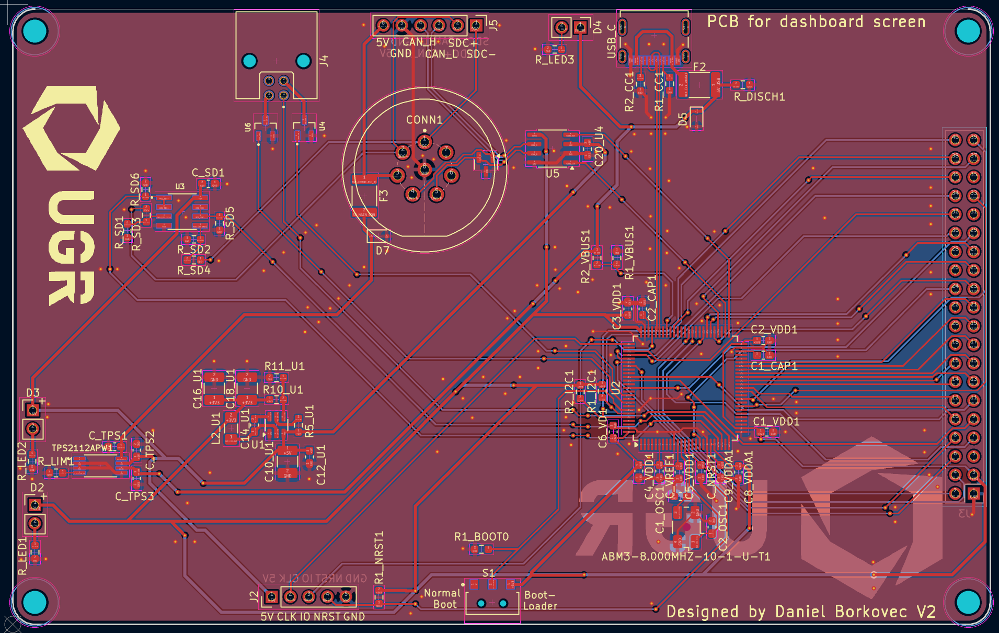

<h1 align="center">🏎️ Formula Student Driver Display</h1>

<p align="center">
  Custom STM32F767-based vehicle dashboard developed for
  <b>UGRacing Formula Student</b>.
</p>

<p align="center">
  
  
  
  
  
  
  
  
</p>

<p align="center">
  
</p>

## 📌 Overview

The Formula Student Driver Display is a custom embedded dashboard designed
for UGRacing's race car.

The system combines a **custom PCB**, an **STM32F767 Cortex-M7**, an
**800×480 LCD**, capacitive touchscreen input, CAN vehicle communication,
and a custom graphics and dashboard stack written in embedded C.

> [!NOTE]
> **My contribution:** schematic capture · PCB layout · SMD assembly ·
> board bring-up · STM32 firmware · display integration · CAN · touchscreen ·
> graphics/UI · system testing

---

## ✨ Highlights

| Feature               | Implementation                               |
| --------------------- | -------------------------------------------- |
| **Microcontroller**   | STM32F767VGT6 Cortex-M7                      |
| **Display**           | 800×480 SSD1963-based LCD                    |
| **Display Interface** | STM32 FMC parallel bus                       |
| **Touch Controller**  | GT911 over I²C                               |
| **Vehicle Data**      | CAN bus                                      |
| **Graphics**          | Custom drawing, text and dashboard rendering |
| **Storage**           | SD card / FatFs                              |
| **Hardware**          | Custom PCB designed in KiCad                 |
| **Firmware**          | Embedded C using STM32 HAL                   |

---

## 🖥️ Dashboard UI

The display presents live vehicle telemetry through several purpose-built
dashboard layouts.

<table>
<tr>
  <td width="50%" align="center">
    
    <br>
    <sub><b>Endurance Dashboard</b></sub>
  </td>
  <td width="50%" align="center">
    
    <br>
    <sub><b>Pedal Telemetry View</b></sub>
  </td>
</tr>
</table>

Vehicle data represented by the dashboard includes:

* charge level
* cell temperature
* vehicle speed
* lap information
* throttle position
* brake position

The graphics stack includes custom primitives, font rendering, dashboard
widgets, and screen-state handling rather than relying on a high-level
embedded GUI framework.

---

## ⚡ Hardware

<p align="center">
  
</p>

The custom board is centred around an **STM32F767VGT6** and integrates the
interfaces required by the display system.

Key hardware interfaces include:

* CAN vehicle communications
* parallel LCD bus through FMC
* I²C touchscreen interface
* SPI peripherals
* ADC inputs
* SD card storage
* USB device connectivity
* supporting vehicle I/O

The published PCB revision shown in this repository was developed in
**KiCad**. A subsequent redesign of the display hardware was completed in
**Altium Designer**, reflecting the PCB design workflow used for my later
electronics projects.

The full KiCad schematic, PCB layout, and project libraries for the
published revision are available in [`Hardware/`](Hardware/).

---

## 💻 Firmware

The firmware is written in **C** using the STM32 HAL ecosystem.

Major software components include:

```text
Display Controller
├── SSD1963 LCD driver
├── FMC interface
├── backlight control
└── display initialisation

Dashboard
├── graphics primitives
├── text and font rendering
├── endurance dashboard
├── pedal telemetry dashboard
└── screen-state management

Vehicle Interfaces
├── CAN reception
├── telemetry decoding
├── ADC monitoring
└── supporting peripheral interfaces

Human Interface
├── GT911 touchscreen
└── touch-driven screen behaviour
```

The application firmware is separated into dedicated modules for display
control, graphics, dashboards, CAN communications, touchscreen handling
and peripheral interfaces.

The main application source is available in
[`Firmware/Core/Src/`](Firmware/Core/Src/), with corresponding interfaces
in [`Firmware/Core/Inc/`](Firmware/Core/Inc/).

---

## 🔗 System Integration

```text
Vehicle CAN Bus
      │
      ▼
 STM32F767
      │
      ├── CAN telemetry
      ├── ADC / peripheral inputs
      │
      ├── I²C ──► GT911 Touch Controller
      │
      └── FMC ──► SSD1963 ──► 800×480 LCD
```

The STM32 acts as the central integration point, receiving vehicle data,
managing the user interface and driving the display through the parallel
FMC interface.

---

## 📁 Project Structure

```text
Formula-Student-Driver-Display/
├── Firmware/
│   ├── Core/
│   ├── Drivers/
│   ├── FATFS/
│   └── USB_DEVICE/
├── Hardware/
│   ├── Custom_Libs/
│   ├── UGR_Driver_Screen_26.kicad_pcb
│   └── UGR_Driver_Screen_26.kicad_sch
├── Tools/
├── docs/
│   └── images/
└── README.md
```

---

<p align="center">
  <a href="../README.md">← Back to Engineering Portfolio</a>
</p>
