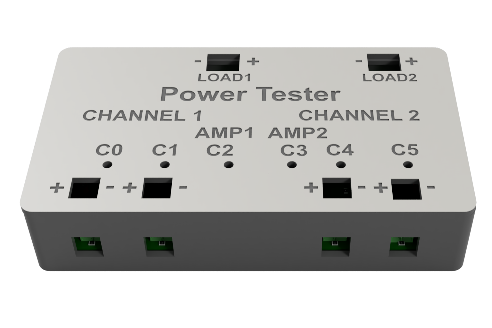

<h1 align="center">⚙️ Daniel Borkovec - Engineering Portfolio</h1>

  <b>Embedded Systems & Electronics Engineer</b>

  MEng Electrical & Electronic Engineering · University of Glasgow

  
  
  
  

  Selected engineering projects spanning embedded firmware, custom electronics,
  PCB and schematic design, sensing, communications, testing, and hardware/software integration.

---

## 🏎️ Formula Student Driver Display

  

  
  
  
  
  
  

Custom embedded driver display developed for **UGRacing Formula Student**, combining a custom SMD PCB, STM32F767 firmware, CAN communications, an 800×480 touchscreen, and a purpose-built graphics/UI stack.

The published PCB revision was developed in **KiCad**, with subsequent redesign work carried out in **Altium Designer**.

> **My role:** PCB and schematic design · SMD assembly · board bring-up · embedded C · display firmware · dashboard modes · CAN · touchscreen · hardware/software integration

### → [Explore the project](Formula-Student-Driver-Display/)

---

## ⚡ Automated Power Test Platform

  

  
  
  
  
  
  

Custom automated test platform combining an FT232H-controlled PCB,
multi-point voltage/current monitoring, switched and programmable MOSFET
loads, Python automation and analysis, and a purpose-built 3D-printed
enclosure with visual output indication.

> **My role:** schematic & PCB design · Python automation ·
> data analysis · FT232H interfacing · power measurement · programmable loads ·
> 3D CAD & printing

### → [Explore the project](Automated-Power-Test-Platform/)

---

## 🤖 Autonomous Line-Following Rover

  

  
  
  
  
  

Autonomous embedded rover combining real-time C++ control, line sensing, ultrasonic ranging, colour detection, Bluetooth communication, motor control, and system-level integration.

> **My role:** Team lead · embedded C++ · control architecture · motor and line-sensing electronics · subsystem integration

### → [Explore the project](Autonomous-Line-Following-Rover/)

---

## 🛠️ Technical Focus

| Area                      | Technologies                                                                         |
| ------------------------- | ------------------------------------------------------------------------------------ |
| **Programming & Digital** | C · C++ · Python · VHDL · STM32 · Git                                                |
| **Hardware**              | Altium Designer · PCB & Schematic Design · SMD Assembly · Oscilloscope · 3D Printing |
| **Embedded Systems**      | CAN · I²C · SPI · USB · parallel display interfaces · hardware/software integration  |

---

## 👋 About

I am a penultimate-year **MEng Electrical & Electronic Engineering** student at the **University of Glasgow**, focused on embedded systems, digital hardware, PCB design, and low-level software.

My experience spans embedded firmware, PCB and schematic design, automated hardware testing, hardware debugging, and end-to-end hardware/software integration.

  

